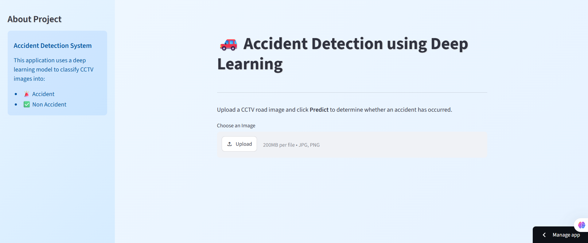
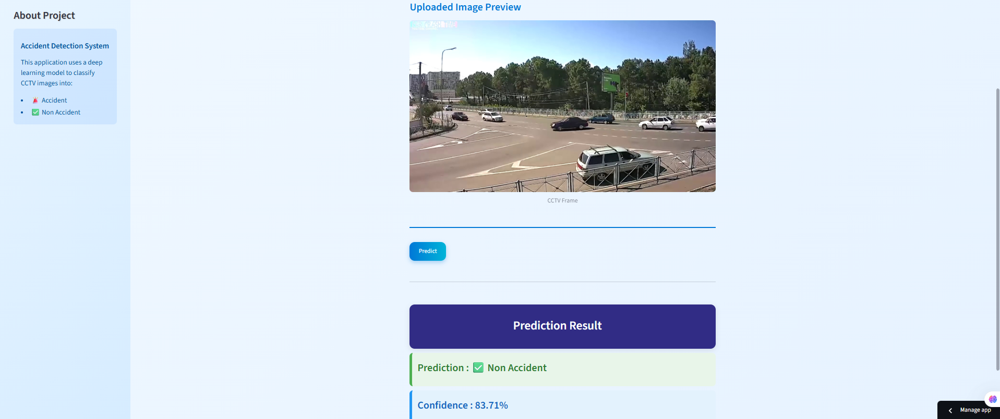

# 🚗 AI Accident Detection using Deep Learning

## Overview

This project focuses on developing an intelligent image classification system that can identify whether a road scene represents an accident or a normal traffic situation. The objective was to explore different deep learning techniques and determine which approach provides the most reliable performance for accident detection.

Three different models were developed and evaluated:
- A Convolutional Neural Network (CNN) built from scratch
- Transfer Learning using EfficientNetB0
- EfficientNetB0 combined with Data Augmentation

After comparing their performances, the best model was integrated into a Streamlit web application where users can upload an image and receive an instant prediction.

---

## Motivation

Automatic accident detection has become an important application of computer vision. Monitoring CCTV footage manually is time-consuming and prone to human error. An AI-powered system can assist in identifying accidents more efficiently and support quicker emergency response.

This project demonstrates how transfer learning can significantly improve image classification performance on a relatively small dataset.

---

## Dataset Description

The dataset consists of road traffic images categorized into two classes:

- Accident
- Non Accident

The data was organized into separate Training, Validation, and Testing folders to ensure proper model evaluation.

---

## Project Pipeline

- Data Preparation
- Image Preprocessing
- CNN Model Development
- Transfer Learning with EfficientNetB0
- Data Augmentation
- Performance Evaluation
- Model Comparison
- Streamlit Deployment

---

## Technologies Used

- Python
- TensorFlow
- Keras
- EfficientNetB0
- OpenCV
- NumPy
- Pandas
- Matplotlib
- Seaborn
- Streamlit
- Scikit-learn

---

## Model Performance

| Model | Training Accuracy | Validation Accuracy | Test Accuracy |
|-------|------------------:|--------------------:|--------------:|
| CNN From Scratch | 61.69% | 65.31% | 58.00% |
| EfficientNetB0 | **91.28%** | **91.84%** | **92.00%** |
| EfficientNetB0 + Data Augmentation | 60.68% | 61.22% | 61.00% |

---

## Best Performing Model

The Transfer Learning model built using EfficientNetB0 achieved the highest overall performance and was selected for deployment.

**Model Details**

- Architecture: EfficientNetB0
- Framework: TensorFlow / Keras
- Input Size: 224 × 224
- Output Classes: Accident / Non Accident
- Test Accuracy: **92%**

---

## Web Application

A Streamlit application was developed to make the model easy to use.

The application allows users to:

- Upload road images
- Perform automatic accident detection
- View prediction confidence
- Get results within a few seconds

---

## Future Scope

This project can be extended in several ways:

- Detect accidents from live CCTV video streams
- Integrate object detection models such as YOLO
- Send automated emergency notifications
- Deploy the application on cloud platforms
- Build a mobile-friendly interface

---

## What I Learned

Working on this project helped me strengthen my understanding of:

- Deep Learning model development
- Transfer Learning
- Image preprocessing techniques
- Performance evaluation
- Streamlit deployment
- End-to-end AI application development

---

## Author

**Priya Srivastava**

Aspiring Data Analyst | Machine Learning & Deep Learning Enthusiast

Thank you for visiting this repository. Feedback and suggestions are always welcome.

